# System Design Overview

A high-level view of Dash's architecture, similar to what you'd see in a system design interview or video tutorial.

## System Architecture Diagram

```mermaid
flowchart TB
    subgraph Clients["👤 Clients"]
        Browser["🌐 Web Browser"]
        ExtAPI["🔌 External Systems"]
    end

    subgraph EdgeLayer["Edge Layer"]
        LB["⚖️ Load Balancer<br/><small>Fly.io Proxy</small>"]
    end

    subgraph WebNodes["Web Nodes <small>(APP_ROLE=web)</small>"]
        Phoenix["🔥 Phoenix<br/><small>HTTP + WebSocket</small>"]
        LiveView["📺 LiveView<br/><small>Real-time UI</small>"]
        API["🔗 REST API<br/><small>JSON Endpoints</small>"]
    end

    subgraph IngestorNodes["Ingestor Nodes <small>(APP_ROLE=ingestor)</small>"]
        Webhook["📥 Webhook<br/>Receiver"]
        Workers["⚙️ Pipeline<br/>Workers"]
        Oban["📋 Oban<br/><small>Job Queue</small>"]
        Transformer["🔄 Data<br/>Transformer"]
    end

    subgraph Messaging["Messaging"]
        PubSub["📡 Phoenix PubSub<br/><small>Cluster Events</small>"]
    end

    subgraph DataStores["Data Stores"]
        subgraph Bronze["🥉 Bronze Layer"]
            R2["☁️ Cloudflare R2<br/><small>Raw JSONL</small>"]
        end
        subgraph Silver["🥈 Silver Layer"]
            TimescaleDB["📊 TimescaleDB<br/><small>Time-Series</small>"]
        end
        subgraph Operational["Operational"]
            Postgres["🐘 PostgreSQL<br/><small>Users, Pipelines, Config</small>"]
            ETS["💾 ETS Cache<br/><small>Hot Data</small>"]
        end
    end

    subgraph External["External Integrations"]
        Sources["📡 Data Sources<br/><small>APIs, Webhooks</small>"]
        Sinks["📤 Data Sinks<br/><small>Webhooks, Email, Slack</small>"]
    end

    %% Client connections
    Browser -->|HTTPS| LB
    ExtAPI -->|Webhook POST| LB

    %% Load balancer routing
    LB -->|User Traffic| Phoenix
    LB -->|Pipeline Data| Webhook

    %% Web node internals
    Phoenix --> LiveView
    Phoenix --> API

    %% Ingestor flow
    Webhook --> Workers
    Oban --> Workers
    Workers --> Transformer
    Transformer --> R2
    Transformer --> TimescaleDB

    %% External integrations
    Sources -->|Poll/Stream| Workers
    Transformer --> Sinks

    %% PubSub messaging
    Workers -->|Broadcast| PubSub
    PubSub -->|Subscribe| LiveView

    %% Data access
    LiveView --> ETS
    LiveView --> TimescaleDB
    API --> Postgres
    Workers --> Postgres

    %% Styling
    style Clients fill:#e3f2fd,stroke:#1976d2
    style EdgeLayer fill:#fff3e0,stroke:#f57c00
    style WebNodes fill:#e8f5e9,stroke:#388e3c
    style IngestorNodes fill:#fce4ec,stroke:#c2185b
    style Messaging fill:#fff9c4,stroke:#fbc02d
    style Bronze fill:#cd7f32,stroke:#8b4513,color:#fff
    style Silver fill:#c0c0c0,stroke:#696969
    style Operational fill:#f3e5f5,stroke:#7b1fa2
    style External fill:#eceff1,stroke:#607d8b
```

---

## Data Flow Patterns

### 1. User Request Flow (Dashboard Viewing)

### 2. Pipeline Polling Flow

### 3. Webhook Ingestion Flow

### 4. Pipeline Replay Flow

---

## Key Components

| Component | Technology | Purpose | Scaling Strategy |
|-----------|------------|---------|------------------|
| **Load Balancer** | Fly.io Proxy | Route traffic, SSL termination, health checks | Automatic (managed) |
| **Web Nodes** | Phoenix + LiveView | Serve UI, maintain WebSocket connections | Horizontal (add nodes) |
| **Ingestor Nodes** | GenServer + Oban | Process pipelines, transform data | Horizontal (add nodes) |
| **Data Processing** | Explorer + Arrow | Zero-copy DataFrame operations for replays | CPU-bound (Rust NIFs) |
| **Bronze Layer** | Cloudflare R2 (Parquet) | Raw data lake (source of truth) | Unlimited (object storage) |
| **Silver Layer** | TimescaleDB | Optimized time-series queries | Vertical + Read replicas |
| **Operational DB** | PostgreSQL | Users, teams, pipeline configs | Vertical + Read replicas |
| **Cache** | ETS | Hot data (last 100 records/pipeline) | Per-node (local) |
| **Messaging** | Phoenix PubSub | Real-time cluster communication | Automatic (BEAM cluster) |

---

## Estimated Scale & Capacity

### Phase 1: MVP (Single Node)

| Metric | Capacity |
|--------|----------|
| **Concurrent Users** | 100-500 |
| **Active Pipelines** | 50-200 |
| **Data Points/Second** | 100-500 |
| **Storage** | 10-50 GB |
| **Infrastructure Cost** | $50-200/month |

### Phase 3: Production (Distributed)

| Metric | Capacity |
|--------|----------|
| **Concurrent Users** | 10,000-50,000 |
| **Active Pipelines** | 5,000-20,000 |
| **Data Points/Second** | 10,000-100,000 |
| **Storage** | 1-10 TB |
| **Infrastructure Cost** | $2,000-10,000/month |

---

## Technology Choices

### Why These Technologies?

| Choice | Alternatives Considered | Rationale |
|--------|------------------------|-----------|
| **Elixir/Phoenix** | Node.js, Go, Python | Built-in concurrency, fault tolerance, real-time via LiveView |
| **Explorer/Arrow** | Pandas, Polars, raw Ecto | Zero-copy reads, Rust performance, native Elixir API |
| **TimescaleDB** | InfluxDB, ClickHouse | SQL compatibility, PostgreSQL ecosystem, compression |
| **Parquet** | JSONL, CSV, Avro | Columnar compression, fast analytics, Arrow-native |
| **Cloudflare R2** | AWS S3, GCS | No egress fees, S3-compatible, global edge |
| **Fly.io** | AWS, Vercel, Railway | Elixir-optimized, global edge, simple clustering |
| **Oban** | Sidekiq, Bull | Native Elixir, PostgreSQL-backed, reliable |
| **Phoenix PubSub** | Redis Pub/Sub, Kafka | Built-in, zero-config clustering, BEAM native |

### What We're NOT Using (And Why)

| Technology | Why Not |
|------------|---------|
| **Kubernetes** | Overkill for Phase 1-2; BEAM clustering is simpler |
| **Redis** | PostgreSQL + ETS sufficient; fewer moving parts |
| **Kafka** | Phoenix PubSub handles our scale; Kafka adds complexity |
| **GraphQL (initially)** | REST + LiveView sufficient for MVP; add later if needed |
| **Microservices** | Monolith first; extract services when pain points emerge |

---

## Security Model

**Security Layers:**

1. **Edge**: TLS termination, DDoS protection (Fly.io/Cloudflare)
2. **Authentication**: AshAuthentication (session-based for users, HMAC for webhooks)
3. **Authorization**: Ash policies (row-level security, RBAC)
4. **Network**: Private mesh between nodes (WireGuard)
5. **Data**: Encryption at rest (PostgreSQL), secrets in Fly.io Secrets

---

## Related Documentation

- [01-architecture.md](01-architecture.md) - Detailed architecture with layer diagram
- [03-database.md](03-database.md) - Database schema and Medallion architecture
- [04-pipelines.md](04-pipelines.md) - Pipeline implementation details
- [07-deployment.md](07-deployment.md) - Deployment configuration

---

*Inspired by system design resources from [System Design Newsletter](https://newsletter.systemdesign.one/) and [AlgoMaster](https://blog.algomaster.io/).*
