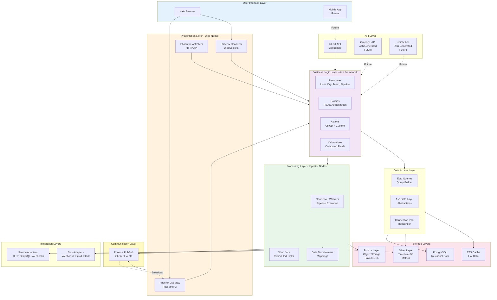
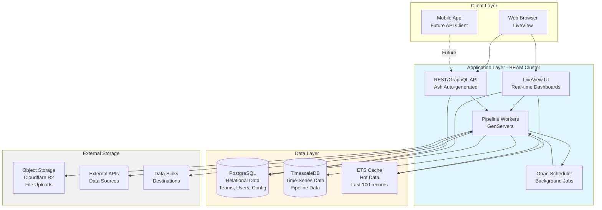
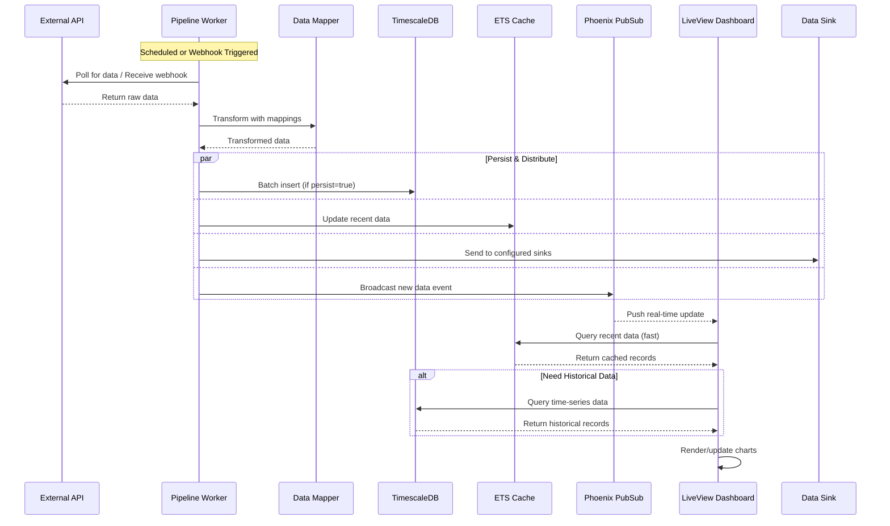
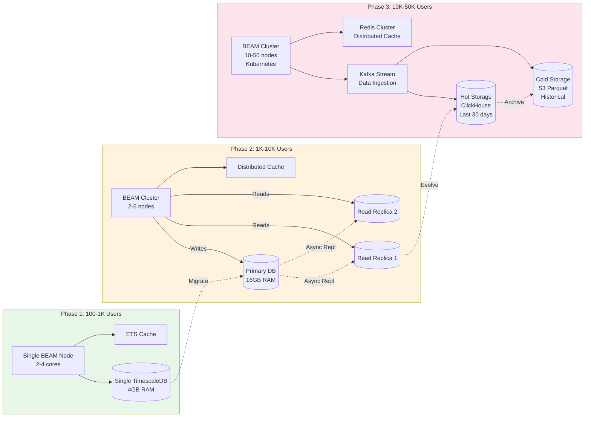

# Architecture Overview

Dash is a real-time data pipeline and visualization platform built on the BEAM VM (Elixir/Phoenix). The system scales from a single node serving hundreds of users to a distributed cluster handling tens of thousands of users with high-throughput data ingestion.

## Core Design Principles

1. **Real-time First**: LiveView-powered dashboards update instantly as data flows through pipelines
2. **Scalable by Design**: Horizontal scaling via BEAM clustering with specialized node roles
3. **Data Durability**: Multi-tiered storage (Bronze/Silver) enables replay and schema evolution
4. **Developer Experience**: Ash Framework provides declarative resource definitions and auto-generated APIs

## Distributed System Architecture

### Heterogeneous Clustering

Dash operates as a distributed BEAM cluster with specialized node roles to ensure heavy data processing never impacts UI responsiveness.

**Node Roles:**

- **`APP_ROLE=web`** - User-facing nodes
  - Optimized for: RAM and connection handling
  - Runs: Phoenix Endpoint, LiveView processes, static assets
  - Purpose: Serve web traffic and maintain WebSocket connections

- **`APP_ROLE=ingestor`** - Data processing nodes
  - Optimized for: CPU and throughput
  - Runs: Pipeline workers (GenServers), Oban job queue, Data Lake writers
  - Purpose: Handle heavy data ingestion and transformation workloads

### Distributed Communication

**Node Discovery:**
- Uses `dns_cluster` for automatic BEAM node peering
- Works with Fly.io's .internal DNS or Kubernetes headless services
- Nodes automatically join/leave cluster without manual configuration

**Real-time Updates:**
- Ingestor nodes broadcast via `Phoenix.PubSub` when batches are flushed
- Web nodes subscribe to `pipeline:<id>` topics
- LiveViews receive updates and push to clients via WebSockets

**State Management:**
- Pipeline configurations cached in distributed ETS table (via `:pg` or Horde)
- Ensures all nodes have consistent view of active pipelines
- Automatic failover if primary node crashes

### Security & Isolation

**Private Network:**
- Ingestor nodes are **not** exposed to public internet
- Communication happens over encrypted Fly.io WireGuard mesh (or k8s internal network)
- Only web nodes accept external traffic

**Token Authentication:**
- All pipeline ingress requires signed `pipeline_secret` in HTTP headers
- HMAC signature verification prevents unauthorized data submission
- Secrets encrypted at rest in PostgreSQL

---

**Note on Implementation Timeline:**

The distributed architecture described above is the **target production design**. Implementation follows this timeline:

- **Phase 1-2 (MVP)**: Single Fly.io node runs all components (web + ingestor)
- **Phase 3 (Month 7+)**: Split into specialized web and ingestor nodes when traffic justifies it

For detailed migration path, see [future-phases/01-distributed-architecture.md](../architecture/future-phases/01-distributed-architecture.md).

---

## Application Layers

Dash is built with a layered architecture where each layer has specific responsibilities and can scale independently.

### Layer Diagram

### Layer Responsibilities

#### 1. User Interface Layer
- **Components**: Web browsers, mobile apps (future)
- **Purpose**: User interaction and display
- **Technologies**: HTML/CSS/JavaScript, Phoenix LiveView client

#### 2. Presentation Layer (Web Nodes)
- **Components**: Phoenix LiveView, Phoenix Channels, HTTP endpoints
- **Purpose**: Serve UI and maintain WebSocket connections
- **Optimization**: RAM and connection handling
- **Runs on**: `APP_ROLE=web` nodes

#### 3. API Layer
- **Components**: REST controllers, auto-generated GraphQL/JSON:API (future)
- **Purpose**: Programmatic access to Dash
- **Authentication**: Token-based, pipeline-specific tokens

#### 4. Business Logic Layer (Ash Framework)
- **Components**: Resources, policies, actions, calculations
- **Purpose**: Domain logic and authorization
- **Key Features**:
  - Declarative resource definitions
  - Row-level security with policies
  - Automatic API generation
  - Changesets and validations

#### 5. Processing Layer (Ingestor Nodes)
- **Components**: GenServer workers, Oban jobs, data transformers
- **Purpose**: Heavy data processing and pipeline execution
- **Optimization**: CPU and throughput
- **Runs on**: `APP_ROLE=ingestor` nodes
- **Key Processes**:
  - Pipeline polling workers
  - Webhook receivers
  - Data transformation
  - Bronze/Silver layer writes

#### 6. Data Access Layer
- **Components**: Ecto queries, Ash data layer, connection pooling
- **Purpose**: Database abstraction and query optimization
- **Features**:
  - Composable queries
  - Connection pooling
  - Read replica support
  - Query optimization

#### 7. Storage Layers (Medallion Architecture)
- **Bronze Layer**: Raw JSONL in object storage (R2/S3)
  - Purpose: Permanent source of truth
  - Enables: Pipeline replays, schema evolution
- **Silver Layer**: TimescaleDB time-series data
  - Purpose: Fast analytical queries
  - Enables: Real-time dashboards
- **Relational**: PostgreSQL for application data
  - Purpose: Users, teams, pipelines, configs
- **Cache**: ETS in-memory cache
  - Purpose: Hot data (last 100 records per pipeline)

#### 8. Communication Layer
- **Component**: Phoenix PubSub
- **Purpose**: Cluster-wide event broadcasting
- **Topics**: `pipeline:<id>`, `dashboard:<id>`
- **Use**: Real-time updates from ingestor → web nodes

#### 9. Integration Layers
- **Source Adapters**: Fetch data from external systems
  - HTTP API, GraphQL, webhooks, P2P pipelines
- **Sink Adapters**: Send data to external systems
  - Webhooks, email, Slack, custom APIs

### Cross-Cutting Concerns

**Security** (spans all layers):
- Authentication (AshAuthentication)
- Authorization (Ash policies)
- Encryption (at-rest and in-transit)
- Token management

**Observability** (instruments all layers):
- Structured logging (Elixir Logger)
- Metrics (Telemetry)
- Error tracking (Sentry)
- Health checks

**Reliability** (fault tolerance at each layer):
- Supervision trees
- Backpressure mechanisms
- Circuit breakers
- Retry logic

### Layer Scaling Strategy

| Layer | Phase 1 (MVP) | Phase 3 (Scale) |
|-------|---------------|-----------------|
| **Presentation** | Single node | Multi-region web nodes |
| **Processing** | Same node | Dedicated ingestor nodes |
| **Storage** | Single PostgreSQL | Primary + read replicas |
| **Cache** | Local ETS | Distributed cache (Horde) |
| **Communication** | Local PubSub | Distributed PubSub |

### Layer Abstraction Strategy

Infrastructure layers are abstracted using **Elixir Behaviours** to enable:
- Swappable implementations (R2 → S3, TimescaleDB → ClickHouse)
- Test adapters (in-memory mocks instead of real storage)
- Self-hosted deployments (local filesystem, bring-your-own database)

| Layer | Behaviour | Default Adapter |
|-------|-----------|-----------------|
| **Bronze (Data Lake)** | `Dash.Storage.Lake` | R2Adapter |
| **Silver (Metrics)** | `Dash.Storage.Metrics` | TimescaleAdapter |
| **Processing** | `Dash.Processing.Engine` | ObanAdapter |
| **Cache** | `Dash.Cache` | EtsAdapter |

**Implementation approach**: Extract Behaviours incrementally when there's a concrete need (testing, self-hosted, technology migration). See [DR-007](../reference/decisions.md#dr-007-layer-abstraction-with-behaviours) for full rationale.

---

## High-Level System Architecture

## Data Flow Architecture

## Pipeline Execution Flow

## Scaling Phases

## Notes on Cost by Phase

- **Phase 1**: $500-2K/month infrastructure
- **Phase 2**: $10-20K/month infrastructure
- **Phase 3**: $50-100K/month infrastructure

---

## Key Changes Made

1. **Removed spaces from subgraph IDs**: Changed `"Application Layer - BEAM Cluster"` to `ApplicationLayer` with display name in brackets
2. **Fixed style references**: Now references the ID (`ApplicationLayer`) instead of the display name
3. **Applied same fix to all three diagrams** that had style statements

This syntax is compatible with GitHub, GitLab, and most Mermaid renderers.
