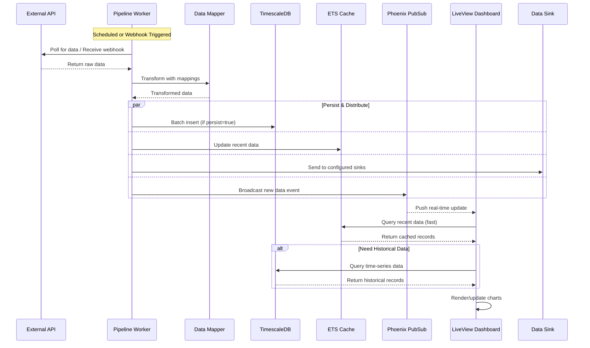
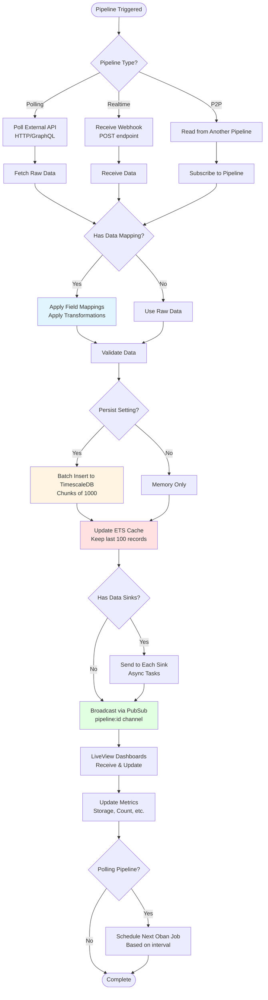

## Architecture Overview

### High-Level System Architecture

```mermaid
graph TB
    subgraph "Client Layer"
        Web[Web Browser<br/>LiveView]
        Mobile[Mobile App<br/>Future API Client]
    end
    
    subgraph "Application Layer - BEAM Cluster"
        LV[LiveView UI<br/>Real-time Dashboards]
        API[REST/GraphQL API<br/>Ash Auto-generated]
        Workers[Pipeline Workers<br/>GenServers]
        Scheduler[Oban Scheduler<br/>Background Jobs]
    end
    
    subgraph "Data Layer"
        PG[(PostgreSQL<br/>Relational Data<br/>Teams, Users, Config)]
        TS[(TimescaleDB<br/>Time-Series Data<br/>Pipeline Data)]
        Cache[ETS Cache<br/>Hot Data<br/>Last 100 records]
    end
    
    subgraph "External Storage"
        S3[Object Storage<br/>Cloudflare R2<br/>File Uploads]
        ExtAPI[External APIs<br/>Data Sources]
        Sinks[Data Sinks<br/>Destinations]
    end
    
    Web --> LV
    Web --> API
    Mobile -.Future.-> API
    
    LV --> Workers
    API --> Workers
    
    Workers --> Scheduler
    Scheduler --> Workers
    
    Workers --> PG
    Workers --> TS
    Workers --> Cache
    Workers --> S3
    
    Workers <--> ExtAPI
    Workers --> Sinks
    
    LV --> Cache
    LV --> PG
    API --> PG
    
    style "Application Layer - BEAM Cluster" fill:#e1f5ff
    style "Data Layer" fill:#fff4e1
    style "External Storage" fill:#f0f0f0
```

### Data Flow Architecture



### Pipeline Execution Flow



### Scaling Phases

```mermaid
graph LR
    subgraph "Phase 1: 100-1K Users<br/>$500-2K/month"
        P1_App[Single BEAM Node<br/>2-4 cores]
        P1_DB[(Single TimescaleDB<br/>4GB RAM)]
        P1_Cache[ETS Cache]
        
        P1_App --> P1_DB
        P1_App --> P1_Cache
    end
    
    subgraph "Phase 2: 1K-10K Users<br/>$10-20K/month"
        P2_App[BEAM Cluster<br/>2-5 nodes]
        P2_Primary[(Primary DB<br/>16GB RAM)]
        P2_Replica1[(Read Replica 1)]
        P2_Replica2[(Read Replica 2)]
        P2_Cache[Distributed Cache]
        
        P2_App -->|Writes| P2_Primary
        P2_App -->|Reads| P2_Replica1
        P2_App -->|Reads| P2_Replica2
        P2_Primary -.Async Repl.-> P2_Replica1
        P2_Primary -.Async Repl.-> P2_Replica2
        P2_App --> P2_Cache
    end
    
    subgraph "Phase 3: 10K-50K Users<br/>$50-100K/month"
        P3_App[BEAM Cluster<br/>10-50 nodes<br/>Kubernetes]
        P3_Hot[(Hot Storage<br/>ClickHouse<br/>Last 30 days)]
        P3_Cold[(Cold Storage<br/>S3 Parquet<br/>Historical)]
        P3_Kafka[Kafka Stream<br/>Data Ingestion]
        P3_Cache[Redis Cluster<br/>Distributed Cache]
        
        P3_App --> P3_Kafka
        P3_Kafka --> P3_Hot
        P3_Kafka --> P3_Cold
        P3_App --> P3_Cache
        P3_Hot -.Archive.-> P3_Cold
    end
    
    P1_DB -.Migrate.-> P2_Primary
    P2_Replica1 -.Evolve.-> P3_Hot
    
    style "Phase 1: 100-1K Users<br/>$500-2K/month" fill:#e8f5e9
    style "Phase 2: 1K-10K Users<br/>$10-20K/month" fill:#fff3e0
    style "Phase 3: 10K-50K Users<br/>$50-100K/month" fill:#fce4ec
```

---

