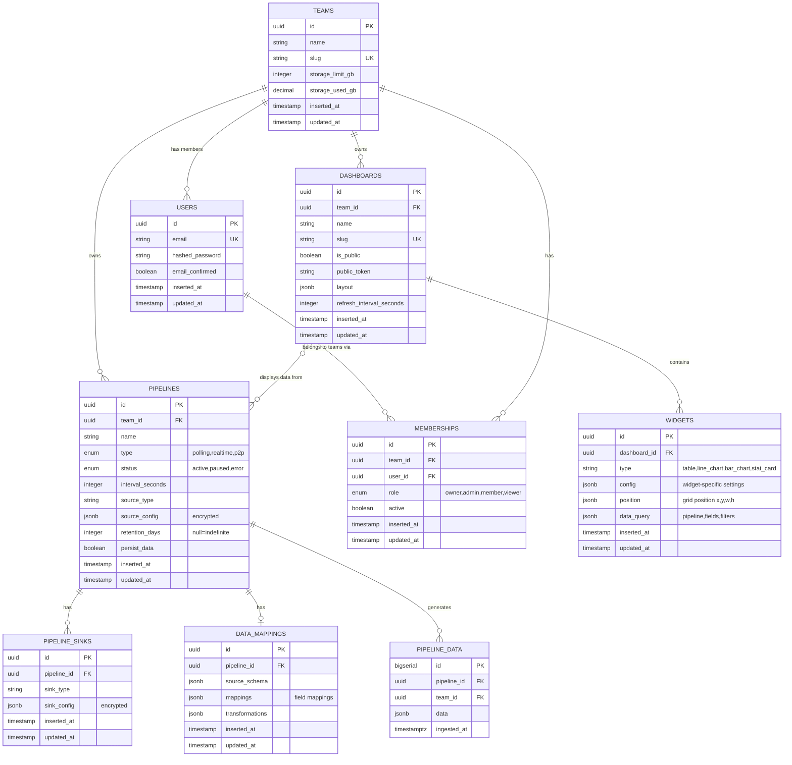

## Database Design

### Entity Relationship Diagram



### TimescaleDB Time-Series Schema

```sql
-- Hypertable for pipeline data (automatically partitioned by time)
CREATE TABLE pipeline_data (
  id BIGSERIAL,
  pipeline_id UUID NOT NULL,
  team_id UUID NOT NULL,
  data JSONB NOT NULL,
  ingested_at TIMESTAMPTZ NOT NULL,
  PRIMARY KEY (pipeline_id, ingested_at, id)
);

-- Convert to hypertable (TimescaleDB magic)
SELECT create_hypertable(
  'pipeline_data', 
  'ingested_at',
  chunk_time_interval => INTERVAL '1 day',
  partitioning_column => 'pipeline_id',
  number_partitions => 4
);

-- Indexes for performance
CREATE INDEX idx_pipeline_data_pipeline_time 
  ON pipeline_data (pipeline_id, ingested_at DESC);

CREATE INDEX idx_pipeline_data_team 
  ON pipeline_data (team_id);

CREATE INDEX idx_pipeline_data_gin 
  ON pipeline_data USING GIN (data);

-- Compression policy (compress data older than 7 days)
SELECT add_compression_policy('pipeline_data', INTERVAL '7 days');

-- Continuous aggregates (pre-computed hourly rollups)
CREATE MATERIALIZED VIEW pipeline_data_hourly
WITH (timescaledb.continuous) AS
SELECT 
  time_bucket('1 hour', ingested_at) AS bucket,
  pipeline_id,
  team_id,
  COUNT(*) as record_count,
  SUM(pg_column_size(data)) as total_bytes
FROM pipeline_data
GROUP BY bucket, pipeline_id, team_id;

-- Refresh policy for continuous aggregate
SELECT add_continuous_aggregate_policy(
  'pipeline_data_hourly',
  start_offset => INTERVAL '3 hours',
  end_offset => INTERVAL '1 hour',
  schedule_interval => INTERVAL '1 hour'
);

-- Retention policy (set per pipeline dynamically)
-- Example: Delete data older than 90 days
-- SELECT add_retention_policy('pipeline_data', INTERVAL '90 days');
```

### Connection Pooling Strategy

```elixir
# config/config.exs

# Main repo for writes
config :dash, Dash.Repo,
  pool_size: 20,  # Smaller pool for writes
  queue_target: 5000,
  queue_interval: 1000

# Read replica pool (points to same DB initially, easy to split later)
config :dash, Dash.Repo.Replica,
  pool_size: 50,  # Larger pool for reads
  queue_target: 5000,
  queue_interval: 1000,
  priv: "priv/repo"  # Share migrations

# Usage pattern:
# Writes: Dash.Repo.insert_all(...)
# Reads: Dash.Repo.Replica.all(...)
```

---

