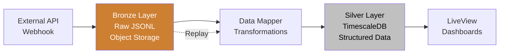

# Database & Storage Architecture

Dash uses a multi-tiered data strategy combining relational PostgreSQL, TimescaleDB time-series storage, and object storage to balance performance, durability, and cost.

## Storage Strategy Overview

### Medallion Architecture

Dash employs a "Medallion" architecture to balance high-speed visualization with long-term data durability.

**Bronze Layer (Raw Data Lake)**
- **Purpose**: Permanent "Source of Truth" for all ingested data
- **Storage**: Object Storage (Cloudflare R2 / Amazon S3 / Google Cloud Storage)
- **Format**: Raw JSONL (Newline-delimited JSON)
- **Workflow**: Every incoming webhook or poll is persisted here *before* transformation
- **Benefits**: Enables non-destructive schema changes and pipeline replays

**Silver Layer (Metric Store)**
- **Purpose**: High-speed analytical storage optimized for queries
- **Storage**: TimescaleDB (PostgreSQL extension)
- **Format**: Structured time-series data (`time`, `pipeline_id`, `metric_name`, `value`)
- **Workflow**: Transformation engine extracts numerical values from Bronze data
- **Benefits**: Fast queries for dashboards and real-time visualizations

### Data Flow



### Replay Engine

When users update pipeline mappings or transformations, Dash performs a **Pipeline Replay**:

1. **Trigger**: User saves new pipeline configuration
2. **Job**: Oban worker (`Dash.Workers.PipelineReplay`) is dispatched
3. **Stream**: Worker streams raw JSONL files from Bronze layer (Object Storage)
4. **Reprocess**: Events pass through Ash Reactor with *new* mapping logic
5. **Upsert**: Resulting metrics are written to Silver layer (TimescaleDB)
6. **Notify**: Dashboard LiveViews receive PubSub notification to refresh

This enables schema evolution without data loss.

### Backpressure & Reliability

To prevent ingestor nodes from OOM crashes during traffic spikes or replays:

- **Mailbox Monitoring**: GenServers reject new requests with `503 Service Unavailable` if internal buffer exceeds 5,000 items
- **Concurrency Limits**: Replay jobs are throttled to avoid competing with real-time ingestion
- **Batch Processing**: Data inserts happen in batches of 1,000 records for optimal performance

---

## Relational Schema (PostgreSQL)

### Entity Relationship Diagram


### TimescaleDB Time-Series Schema

```sql
-- Hypertable for pipeline data (automatically partitioned by time)
CREATE TABLE pipeline_data (
  id BIGSERIAL,
  pipeline_id UUID NOT NULL,
  team_id UUID NOT NULL,
  data JSONB NOT NULL,
  ingested_at TIMESTAMPTZ NOT NULL,
  PRIMARY KEY (pipeline_id, ingested_at, id)
);

-- Convert to hypertable (TimescaleDB magic)
SELECT create_hypertable(
  'pipeline_data',
  'ingested_at',
  chunk_time_interval => INTERVAL '1 day',
  partitioning_column => 'pipeline_id',
  number_partitions => 4
);

-- Indexes for performance
CREATE INDEX idx_pipeline_data_pipeline_time
  ON pipeline_data (pipeline_id, ingested_at DESC);

CREATE INDEX idx_pipeline_data_team
  ON pipeline_data (team_id);

CREATE INDEX idx_pipeline_data_gin
  ON pipeline_data USING GIN (data);

-- Compression policy (compress data older than 7 days)
SELECT add_compression_policy('pipeline_data', INTERVAL '7 days');

-- Continuous aggregates (pre-computed hourly rollups)
CREATE MATERIALIZED VIEW pipeline_data_hourly
WITH (timescaledb.continuous) AS
SELECT
  time_bucket('1 hour', ingested_at) AS bucket,
  pipeline_id,
  team_id,
  COUNT(*) as record_count,
  SUM(pg_column_size(data)) as total_bytes
FROM pipeline_data
GROUP BY bucket, pipeline_id, team_id;

-- Refresh policy for continuous aggregate
SELECT add_continuous_aggregate_policy(
  'pipeline_data_hourly',
  start_offset => INTERVAL '3 hours',
  end_offset => INTERVAL '1 hour',
  schedule_interval => INTERVAL '1 hour'
);

-- Retention policy (set per pipeline dynamically)
-- Example: Delete data older than 90 days
-- SELECT add_retention_policy('pipeline_data', INTERVAL '90 days');
```

### Connection Pooling Strategy

```elixir
# config/config.exs

# Main repo for writes
config :dash, Dash.Repo,
  pool_size: 20,  # Smaller pool for writes
  queue_target: 5000,
  queue_interval: 1000

# Read replica pool (points to same DB initially, easy to split later)
config :dash, Dash.Repo.Replica,
  pool_size: 50,  # Larger pool for reads
  queue_target: 5000,
  queue_interval: 1000,
  priv: "priv/repo"  # Share migrations

# Usage pattern:
# Writes: Dash.Repo.insert_all(...)
# Reads: Dash.Repo.Replica.all(...)
```

---
